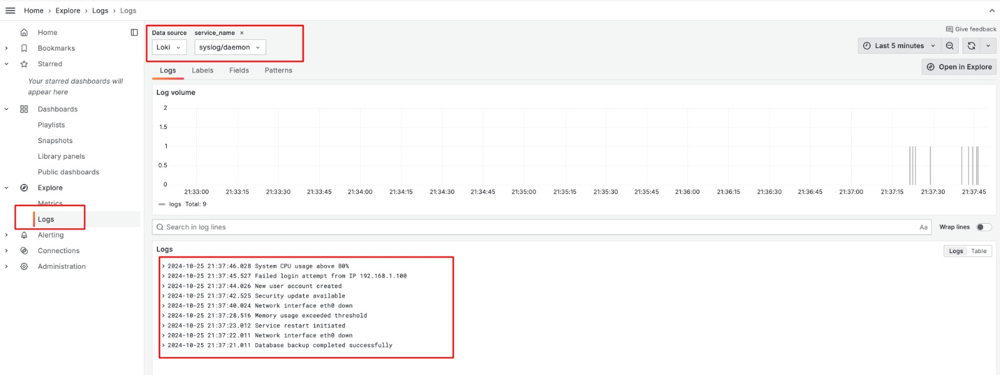

# Grafana Syslog Monitoring Stack

This project sets up a complete monitoring stack for collecting and visualizing syslog messages using Grafana, Loki, and Promtail. It includes a test syslog producer for demonstration purposes.



## Stack Components

- **Grafana**: Visualization and dashboarding platform
- **Loki**: Log aggregation system
- **Promtail**: Log collecting agent (configured for syslog ingestion)
- **Test Syslog Producer**: Python script to generate sample logs

## Prerequisites

- Docker
- Docker Compose
- Python 3.x (for the test producer)

## Directory Structure

```
.
├── docker-compose.yml
├── etc/loki/loki-config.yml
├── etc/promtail/docker-config.yml
├── etc/grafana/grafana-provisioning/datasources/datasource.yml
├── scripts/syslog_producer.py
```

## Quick Start

1. Clone this repository:
   ```bash
   git clone https://github.com/jjo/talks
   cd talks/2024/2024-10-25--Promtail_syslog-Loki-Grafana
   ```

2. Start the monitoring stack:
   ```bash
   make up
   ```

3. Run the test syslog producer:
   ```bash
   make generate-syslog
   ```

4. Access Grafana at http://localhost:3000
   - Default credentials: admin/admin

## Configuration Details

### Promtail Configuration

Promtail is configured to:
- Listen for syslog messages on UDP port 1514
- Parse messages in RFC5424 format
- Add useful labels including:
  - `service_name`: Format "syslog/<facility>"
  - `severity`
  - `facility`
  - `hostname`
  - `app`

### Loki Configuration

Loki is configured with:
- Increased ingestion limits for development
- 72-hour retention period
- Local filesystem storage
- Write-ahead logging enabled

### Test Producer

The syslog producer script can be configured with several options:
```bash
./scripts/syslog_producer.py --help
usage: syslog_producer.py [-h] [--host HOST] [--port PORT] [--interval INTERVAL] [--count COUNT]

options:
  -h, --help           show this help message
  --host HOST          Syslog server host
  --port PORT          Syslog server port
  --interval INTERVAL  Interval between messages in seconds
  --count COUNT        Number of messages to send (default: infinite)
```

## Grafana Usage

### Basic Queries

1. Open Grafana and go to the Explore view
2. Use these example queries:
   ```
   # All syslog messages
   {job="syslog"}

   # Filter by service name
   {service_name="syslog/auth"}

   # Filter by severity
   {severity="err"}
   ```

### Example Dashboard Queries

1. Message volume by service:
   ```
   sum(count_over_time({job="syslog"}[1m])) by (service_name)
   ```

2. Error rate:
   ```
   sum(count_over_time({job="syslog", severity=~"err|emerg|crit"}[5m])) by (severity)
   ```

## Troubleshooting

### Common Issues

1. Promtail parsing errors:
   - Ensure syslog messages follow RFC5424 format
   - Check Promtail logs: `docker-compose logs promtail`

2. Loki ingestion rate limits:
   - Adjust values in `loki-config.yml`
   - Check Loki logs: `docker-compose logs loki`

### Rate Limit Adjustments

If you see ingestion rate limit errors, adjust these values in `loki-config.yml`:
```yaml
limits_config:
  ingestion_rate_mb: 32
  ingestion_burst_size_mb: 64
```

## License

This project is licensed under the MIT License - see the LICENSE file for details.

---
**Note**: Remember to replace `<repository-url>` and `<repository-name>` with your actual repository details. Also, add your own screenshot to the `images/` directory as `screenshot.jpeg`.
